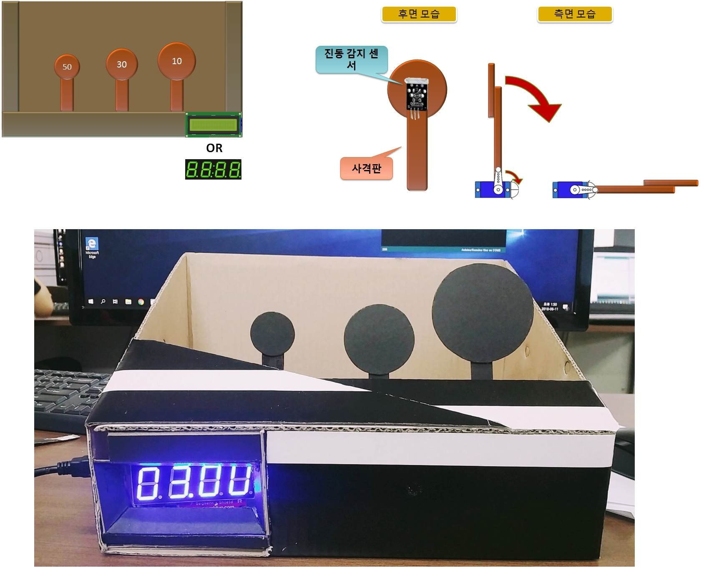

# ArduinoShootingSystem2018

# 기간
    1개월 (2018-04-24 ~ 2018-06-10)
   
   
   
# 개요
    사격장의 사격시스템처럼 아두이노와 센서를 통해 사격판을 맞추면 점수를 계산하고
    , 일정 시간이 지난 후 게임이 끝나는 시스템을 구현합니다.
    
    
    
# 사용한 라이브러리 및 구현 환경
    1. 구현 환경
        - Window 7
        - Arduino
    2. 사용한 라이브러리 및 기능
        - 각종 센서와 모터를 사용한 제어
        
        
        
# 필요 기능과 과정
    1. 사용자에게 보여주기위한 사격판(외형)
    2 진동감지 기능
        - 사격판의 진동감지센서로 진동감지를 통해 사격판이 맞았다는 것을 인지, 서보모터를 제어해
          넘어간 모습을 보여줍니다.
    3. 게임자체(내부적) 기능
        - 점수 합산 기능
        - 사격판 올라오는 순서
        - 게임 시간 등
        
        
        
# 구현 화면

